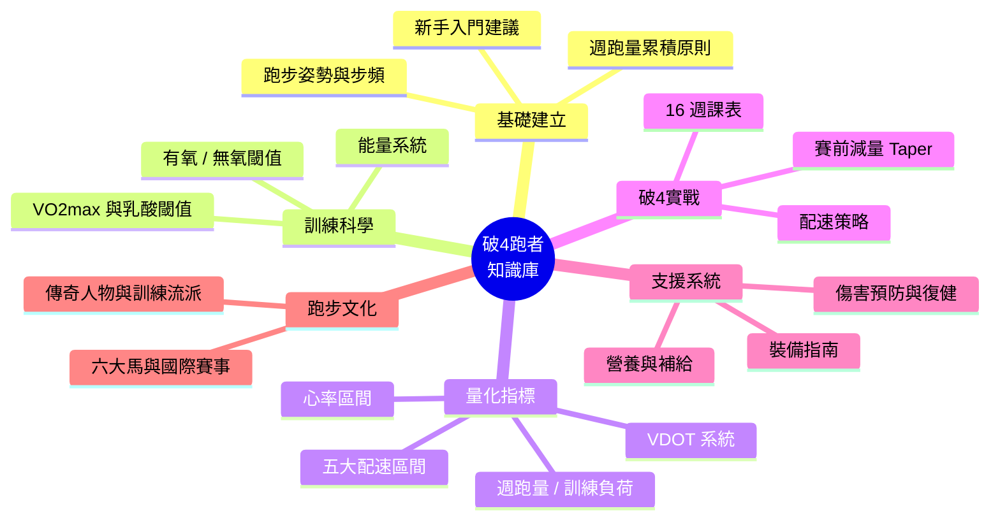

# 🏃 從完賽到破4:專業慢跑跑者知識庫

> 一個為 **破4跑者(sub-4 marathon)** 打造的結構化知識庫。
> 由 **資深馬拉松教練 × 運動醫學 / 物理治療師** 雙視角撰寫 —— 既有實戰課表與配速策略,也兼顧傷害預防、恢復與生物力學。

---

## 📖 這個知識庫適合誰?

- ✅ 你已經完賽過至少一場全程馬拉松(42.195 km)
- ✅ 你目前成績在 **4:00 ~ 4:45** 之間,想突破 **sub-4(全馬 4 小時內,平均配速約 5:41/km)**
- ✅ 你想用更系統化、科學化的方式訓練,而不是只靠「多跑」
- ✅ 你想了解傷害如何預防、營養如何補給、裝備如何選擇

> 💡 即使你還是入門跑者,本知識庫第一章也提供了完整的打底內容,讓你能一路成長到破4。

---

## 🗺️ 知識樹(導讀)

下面這張知識樹呈現整個知識庫的架構與閱讀路徑。建議依照「基礎 → 指標 → 課表 → 支援系統(傷害/營養/裝備)→ 文化(賽事/人物)」的順序閱讀。

---

## 📚 章節目錄

| 章節 | 內容 | 視角 |
|------|------|------|
| [01 · 新手入門建議](docs/01-新手入門.md) | 跑步姿勢、步頻、呼吸、如何安全累積跑量 | 教練 + 物理治療 |
| [02 · 訓練原理](docs/02-訓練原理.md) | 能量系統、有氧基礎、乳酸閾值、VO₂max | 運動生理 |
| [03 · 訓練指標](docs/03-訓練指標.md) | VDOT、五大配速區間、心率區間、訓練負荷 | 教練 |
| [04 · 破4訓練計畫](docs/04-破4訓練計畫.md) | 16 週 sub-4 課表、配速策略、Taper | 教練 |
| [05 · 傷害預防與復健](docs/05-傷害預防與復健.md) | 常見跑步傷害、生物力學、肌力與復健動作 | 運動醫學 / 物理治療 |
| [06 · 營養與補給](docs/06-營養與補給.md) | 平日飲食、肝醣超補、賽中補給、賽後恢復 | 運動醫學 |
| [07 · 裝備指南](docs/07-裝備指南.md) | 跑鞋、碳板競速鞋、運動手錶、機能服飾 | 教練 |
| [08 · 國際賽事](docs/08-國際賽事.md) | 世界六大馬、其他指標賽事、報名與參賽 | 教練 |
| [09 · 關鍵人物與流派](docs/09-關鍵人物與流派.md) | 傳奇跑者、東非王朝、日本馬拉松文化 | 教練 |

---

## 🎯 破4關鍵速查表

| 項目 | 數值 |
|------|------|
| 目標完賽時間 | **3:59:59 以內** |
| 全程平均配速 | **5:41 / km**(約 9:09 / mile) |
| 半程通過時間(略快策略) | 約 **1:58:00** |
| 對應 VDOT | 約 **38**(詳見 [訓練指標](docs/03-訓練指標.md)) |
| 建議巔峰週跑量 | **55 ~ 70 km / 週** |
| 建議訓練週期 | **12 ~ 16 週** |

---

## ⚠️ 免責聲明

本知識庫內容為教育與訓練參考之用,**不能取代專業醫療診斷**。若有心血管疾病史、慢性傷病或任何健康疑慮,請在開始訓練計畫前諮詢醫師或合格運動醫學專業人員。

---

## 📌 資料來源

本知識庫整合自以下公開、權威來源(各章節內另有細部引用):

- Jack Daniels, *Daniels' Running Formula* (VDOT 系統)
- Pete Pfitzinger & Scott Douglas, *Advanced Marathoning*
- Hansons Marathon Method (Luke Humphrey)
- [World Athletics 官方網站](https://worldathletics.org/)
- [Abbott World Marathon Majors 官方網站](https://www.worldmarathonmajors.com/)
- American College of Sports Medicine (ACSM) Position Stands
