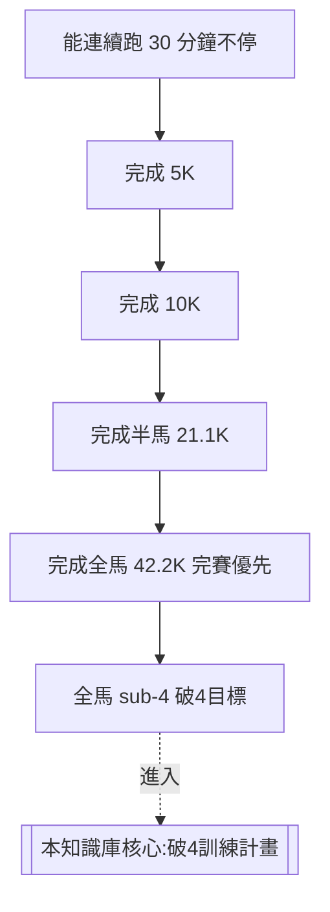

# 01 · 新手入門建議

> [⬅ 回首頁](../README.md) ｜ 下一章:[02 · 訓練原理](02-訓練原理.md)

即使你已是破4目標跑者,基礎的「跑姿、步頻、呼吸、跑量累積」仍是成績能否突破的地基。本章從物理治療與教練雙視角,把容易被忽略的基本功講清楚。給真正剛入門的讀者,則可作為完整的起步指南。

---

## 1. 跑步姿勢(Running Form)

良好的跑姿能降低受傷風險、提升跑步經濟性(Running Economy)。核心原則:

| 部位 | 重點 | 常見錯誤 |
|------|------|----------|
| 頭/眼 | 視線看前方 10–20 公尺 | 低頭看腳 |
| 軀幹 | 上身微前傾(由腳踝發起,非彎腰) | 駝背、過度後仰 |
| 手臂 | 手肘約 90°,前後擺動 | 左右橫向晃動 |
| 觸地 | 落地點靠近身體重心正下方 | 跨大步、腳跟重煞(overstriding) |
| 骨盆 | 保持穩定、不左右塌陷 | 髖部下沉(Trendelenburg) |

> 🩺 **物理治療師提醒**:`overstriding`(跨步過大、腳跟落地遠在重心前方)是膝關節衝擊與脛骨疼痛的主因之一。改善方式是「提高步頻」而非刻意改變落地方式。

---

## 2. 步頻(Cadence)

步頻指每分鐘雙腳總觸地次數(steps per minute, spm)。

- 常被引用的參考值是 **180 spm**,但這並非鐵律 —— 它源自 1984 年跑步教練 Jack Daniels 觀察奧運選手的數據。
- 對一般跑者而言,**個人化目標是「比現況提高約 5–10%」**,即可有效縮短跨步、減少觸地時間與衝擊。
- 提高步頻時請保持配速不變,讓步幅自然縮小。

---

## 3. 呼吸

- 採用**腹式呼吸**(橫膈膜呼吸),吸氣時肚子鼓起,讓氧氣交換更有效率。
- 輕鬆跑時可用「**鼻吸口吐**」或「口鼻並用」;強度越高越需要口呼吸。
- 「**說話測試(Talk Test)**」是判斷輕鬆跑強度的好方法:能完整說出句子=有氧區間;只能擠出單字=已進入高強度。

---

## 4. 安全累積跑量:10% 原則與其限制

| 原則 | 說明 |
|------|------|
| **10% 原則** | 每週總跑量增幅不超過上週的 10%,降低過度使用傷害風險 |
| **3:1 週期** | 連續 3 週漸增後,安排 1 週減量(deload)讓身體吸收訓練 |
| **聆聽身體** | 持續性疼痛、靜息心率異常升高、睡眠變差皆為過度訓練警訊 |

> ⚠️ 10% 只是經驗法則,不是科學定律。重點在於「漸進、有恢復週、依個人反應調整」。

---

## 5. 入門到破4的能力階梯

達到「能輕鬆完成全馬」後,才建議正式進入 [04 · 破4訓練計畫](04-破4訓練計畫.md)。在此之前,先把 [訓練原理](02-訓練原理.md) 與 [訓練指標](03-訓練指標.md) 讀懂,訓練會事半功倍。

---

## 📌 本章資料來源

- Daniels, J. *Daniels' Running Formula*, 3rd ed.
- Heiderscheit BC, et al. "Effects of step rate manipulation on joint mechanics during running." *Med Sci Sports Exerc.* 2011.
- ACSM Guidelines for Exercise Testing and Prescription.

---

> [⬅ 回首頁](../README.md) ｜ 下一章:[02 · 訓練原理](02-訓練原理.md)
