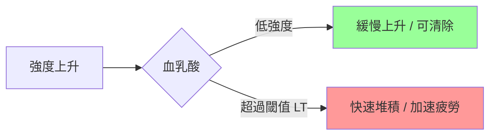
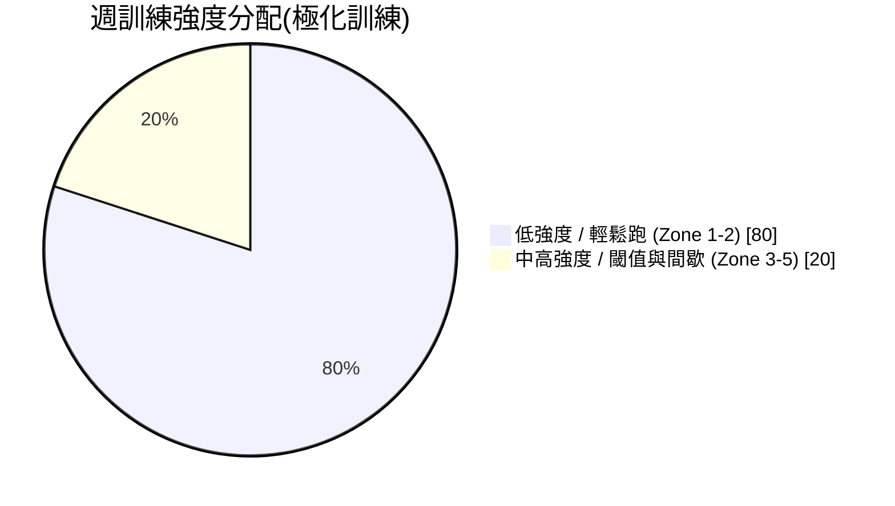

# 02 · 訓練原理(運動生理基礎)

> [⬅ 上一章:01 新手入門](01-新手入門.md) ｜ [回首頁](../README.md) ｜ [下一章:03 訓練指標 ➡](03-訓練指標.md)

想破4,你必須理解「身體用什麼方式產生能量、瓶頸在哪裡、訓練如何改變這些瓶頸」。本章從運動生理(Exercise Physiology)視角解釋馬拉松表現的科學基礎。

---

## 1. 三大能量系統(Energy Systems)

| 系統 | 燃料 | 持續時間 | 馬拉松角色 |
|------|------|----------|------------|
| ATP-PCr(磷酸原) | 肌肉內 ATP/PCr | 0–10 秒 | 起跑爆發、衝線 |
| 醣酵解(Glycolytic / 無氧) | 肌肝醣 | 10 秒–2 分 | 衝刺、爬坡 |
| **有氧(Oxidative)** | 醣類 + 脂肪 | 數分鐘–數小時 | **馬拉松主力(>99%)** |

> 🔑 馬拉松幾乎完全仰賴**有氧系統**。因此破4訓練的核心,是「擴大有氧引擎 + 提高在高比例 VO₂max 下維持有氧代謝的能力」。

---

## 2. VO₂max(最大攝氧量)

- 定義:身體每分鐘能利用氧氣的最大量,單位 `mL/kg/min`。
- 代表你「有氧引擎的排氣量上限」。
- 一般男性約 35–45,女性約 30–40;菁英馬拉松選手可達 70–85。
- **重點**:破4不需要很高的 VO₂max。研究指出,在跑者群體中,VO₂max 並非預測馬拉松成績的最佳單一指標 —— **乳酸閾值與跑步經濟性更關鍵**。

---

## 3. 乳酸閾值(Lactate Threshold, LT)

這是馬拉松表現**最重要**的生理指標之一。

- 隨著強度上升,血乳酸開始快速累積的拐點即為**乳酸閾值**。
- 閾值越高(越接近 VO₂max),你就能在更快的配速下維持「乳酸生成=清除」的平衡,不會提早疲勞。
- 馬拉松配速通常落在 **乳酸閾值配速以下一些**(約 LT 的 80–90%)。

> 🏃 **教練觀點**:閾值跑(Tempo Run)就是直接訓練這條線「往右推」的關鍵課表。詳見 [03 訓練指標](03-訓練指標.md) 與 [04 破4課表](04-破4訓練計畫.md)。

---

## 4. 跑步經濟性(Running Economy, RE)

- 定義:以特定配速跑步時所消耗的氧氣量 —— 越省氧越經濟。
- 兩位 VO₂max 相同的跑者,RE 較佳者跑得更快。
- 改善方式:長期訓練、肌力訓練、改善跑姿、適當的競速鞋([07 裝備指南](07-裝備指南.md))。

---

## 5. 有氧基礎與「80/20 法則」

- **極化訓練(Polarized Training)/ 80/20 法則**:約 80% 跑量為輕鬆有氧,20% 為高強度。
- 多數業餘跑者最大的錯誤是「輕鬆跑跑太快、高強度跑不夠快」,變成全程中強度,效果打折又容易受傷。
- 輕鬆跑的目的是**建立粒線體、微血管密度、脂肪利用能力**,這些是馬拉松後半段不掉速的根基。

---

## 6. 訓練適應原理

| 原理 | 說明 |
|------|------|
| 超負荷(Overload) | 給予略高於現況的刺激,身體才會適應 |
| 漸進(Progression) | 負荷逐步增加,避免受傷 |
| 特殊性(Specificity) | 想破4,就要練到接近馬拉松配速的特定刺激 |
| 可逆性(Reversibility) | 停練會流失,恢復期維持低量比完全停跑好 |
| 個別差異(Individuality) | 同一課表對不同人效果不同,需依反應調整 |

---

## 📌 本章資料來源

- Joyner MJ, Coyle EF. "Endurance exercise performance: the physiology of champions." *J Physiol.* 2008.
- Seiler S. "What is best practice for training intensity and duration distribution in endurance athletes?" *Int J Sports Physiol Perform.* 2010.
- Bassett DR, Howley ET. "Limiting factors for maximum oxygen uptake." *Med Sci Sports Exerc.* 2000.

---

> [⬅ 上一章:01 新手入門](01-新手入門.md) ｜ [回首頁](../README.md) ｜ [下一章:03 訓練指標 ➡](03-訓練指標.md)
