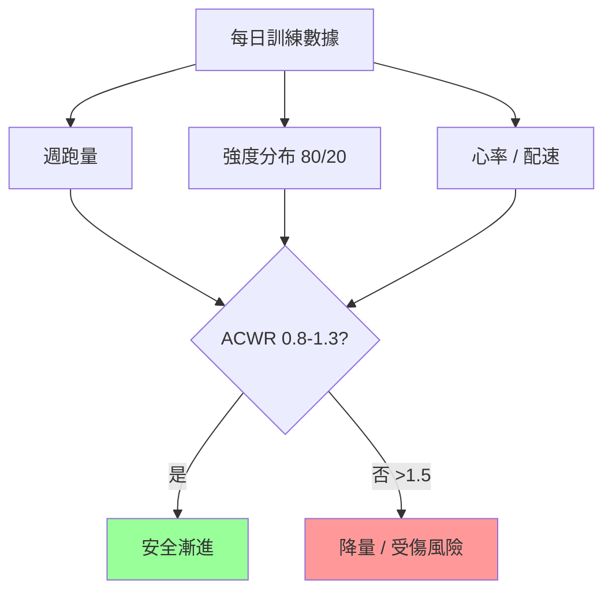

# 03 · 訓練指標(量化你的訓練)

> [⬅ 上一章:02 訓練原理](02-訓練原理.md) ｜ [回首頁](../README.md) ｜ [下一章:04 破4訓練計畫 ➡](04-破4訓練計畫.md)

「無法量化,就無法管理。」本章彙整破4跑者必懂的訓練指標,讓你的每一趟訓練都有明確的強度與目的。

---

## 1. VDOT 系統(Jack Daniels)

VDOT 是 Jack Daniels 提出的「跑力」綜合指標,結合 VO₂max 與跑步經濟性,可由近期比賽成績反推,並對應出各種訓練配速。

**破4跑者大致對應 VDOT ≈ 38。** 參考對照:

| VDOT | 5K | 10K | 半馬 | 全馬 |
|------|-----|-----|------|------|
| 35 | 24:08 | 50:03 | 1:50:59 | 3:50:?(略快於4) |
| **38** | **22:15** | **46:09** | **1:42:17** | **3:32:23** |
| 40 | 21:00 | 43:36 | 1:36:38 | 3:21:00 |

> 💡 對照重點:若你能跑進 **10K 約 50 分鐘 / 半馬約 1:50**,你的有氧能力已具備破4潛力,接下來是把馬拉松「特定耐力」練起來。
> 完整對照表見 [Jack Daniels VDOT 官方計算器](https://vdoto2.com/)。

---

## 2. 五大訓練配速區間(Daniels Pace Zones)

以 VDOT 38(破4目標)為例的概略配速:

| 代號 | 名稱 | 目的 | VDOT38 概略配速 (/km) |
|------|------|------|------------------------|
| **E** | Easy(輕鬆跑) | 建立有氧基礎、恢復 | 6:30 – 7:10 |
| **M** | Marathon(馬拉松配速) | 模擬比賽特定耐力 | **5:41** |
| **T** | Threshold(閾值/節奏跑) | 提升乳酸閾值 | 5:10 – 5:20 |
| **I** | Interval(間歇) | 提升 VO₂max | 4:45 左右(3–5分區段) |
| **R** | Repetition(反覆衝刺) | 速度與經濟性 | 4:25 左右(短) |

> ⚠️ **最常見錯誤**:E 配速跑太快。E 跑要「真的輕鬆、能聊天」,把高強度留給 T/I 課表,這正是 [02 訓練原理](02-訓練原理.md) 的 80/20 法則。

---

## 3. 心率區間(Heart Rate Zones)

需先估算最大心率(HRmax)。常用公式:

- 簡易:`HRmax ≈ 220 − 年齡`(誤差大)
- 較準:`HRmax ≈ 208 − 0.7 × 年齡`(Tanaka 公式)
- 最準:實測(經醫療/教練監控的最大努力測試)

五區間(以 HRmax 百分比):

| 區間 | %HRmax | 體感 | 對應配速 |
|------|--------|------|----------|
| Z1 | 50–60% | 非常輕鬆 | 恢復 |
| Z2 | 60–70% | 輕鬆、可聊天 | E 跑 / 長跑主力 |
| Z3 | 70–80% | 微喘 | M 配速附近 |
| Z4 | 80–90% | 喘、難說話 | T 閾值 |
| Z5 | 90–100% | 極限 | I 間歇 |

> 🩺 **儲備心率(HRR / Karvonen 法)** 比單純 %HRmax 更個人化:
> `目標心率 = (HRmax − 靜息心率) × 強度% + 靜息心率`

---

## 4. 訓練負荷與量化

| 指標 | 說明 | 用途 |
|------|------|------|
| **週跑量(Mileage)** | 每週總公里數 | 破4建議巔峰 55–70 km/週 |
| **長跑佔比** | 單次長跑不超過週量的 ~30–35% | 避免單日過載 |
| **TSS / 訓練壓力** | 結合強度與時間的綜合負荷(部分手錶/平台提供) | 監控疲勞 |
| **ACWR(急慢性負荷比)** | 近 1 週量 ÷ 近 4 週平均 | 建議維持 0.8–1.3,>1.5 受傷風險升高 |

---

## 5. 破4目標換算速查

| 距離 | 破4對應分段(等速) |
|------|---------------------|
| 每 1 km | 5:41 |
| 每 5 km | 28:25 |
| 10 km | 56:50 |
| 半程 21.1 km | 1:59:54 |
| 30 km | 1:50:30(累計約 2:50) |
| 全程 42.2 km | **3:59:59** |

> 實戰常採「前慢後穩」或均速策略,避免前段過快導致 30K 後撞牆。配速策略詳見 [04 破4訓練計畫](04-破4訓練計畫.md)。

---

## 📌 本章資料來源

- Daniels, J. *Daniels' Running Formula*, 3rd ed. (VDOT)
- Tanaka H, et al. "Age-predicted maximal heart rate revisited." *J Am Coll Cardiol.* 2001.
- Gabbett TJ. "The training—injury prevention paradox." *Br J Sports Med.* 2016. (ACWR)

---

> [⬅ 上一章:02 訓練原理](02-訓練原理.md) ｜ [回首頁](../README.md) ｜ [下一章:04 破4訓練計畫 ➡](04-破4訓練計畫.md)
