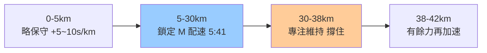

# 04 · 破4訓練計畫(16 週 sub-4 課表)

> [⬅ 上一章:03 訓練指標](03-訓練指標.md) ｜ [回首頁](../README.md) ｜ [下一章:05 傷害預防與復健 ➡](05-傷害預防與復健.md)

這是本知識庫的核心。一份結合教練實戰與運動生理原理的 **16 週破4課表**,把 [02 原理](02-訓練原理.md) 與 [03 指標](03-訓練指標.md) 落實到每一週。

---

## 0. 開始前的前提條件

- ✅ 近期能輕鬆完成單次 **16 km** 長跑
- ✅ 近期週跑量已穩定在 **35–40 km**
- ✅ 近 3 個月無未癒傷病
- ✅ 已測得自己的 **E / M / T 配速**(見 [03 訓練指標](03-訓練指標.md))

破4配速基準(VDOT≈38):**M=5:41/km、T≈5:15/km、E≈6:30–7:10/km**。

---

## 1. 週課表結構(典型一週)

| 星期 | 課表 | 目的 |
|------|------|------|
| 一 | 休息 / 交叉訓練 | 恢復 |
| 二 | **品質課:T 閾值跑** | 提升乳酸閾值 |
| 三 | E 輕鬆跑 | 有氧 + 恢復 |
| 四 | **品質課:M 配速 / 間歇** | 特定耐力 / VO₂max |
| 五 | 休息 或 E 短跑 | 恢復 |
| 六 | E 輕鬆跑 | 有氧 |
| 日 | **長跑(LSD / 含 M 配速段)** | 耐力地基 |

> 一週「**3 趟品質 + 其餘輕鬆**」,符合 80/20 強度分布。

---

## 2. 16 週分期(Periodization)

```mermaid
gantt
    title 16 週破4訓練分期
    dateFormat  X
    axisFormat %s
    section 基礎期
    Base 有氧打底 (W1-4)      :0, 4
    section 進展期
    Build 閾值+長跑 (W5-9)    :4, 5
    section 巔峰期
    Peak 特定耐力 (W10-13)    :9, 4
    section 減量期
    Taper 賽前減量 (W14-16)   :13, 3
```

### 各期重點

| 期 | 週次 | 週跑量 | 重點課表 |
|----|------|--------|----------|
| 基礎期 | W1–4 | 40→50 km | 有氧累積、步頻、輕量 strides |
| 進展期 | W5–9 | 50→65 km | T 閾值跑、長跑漸增至 28 km |
| 巔峰期 | W10–13 | 60→70 km | 長跑內含 M 配速段、最長 32 km |
| 減量期 | W14–16 | 70→40→比賽 | 量降強度維持,儲備狀態 |

---

## 3. 逐週概要(重點課表)

| 週 | 二(T) | 四(M/I) | 日(長跑) |
|----|--------|----------|-----------|
| 1 | 3×6min T | 6×400m R | 16 km E |
| 2 | 4×6min T | 5×800m I | 18 km E |
| 3 | 20min T | 6×800m I | 20 km E |
| 4(減) | 3×6min T | strides | 16 km E |
| 5 | 2×15min T | 8 km @M | 22 km E |
| 6 | 25min T | 10 km @M | 24 km E |
| 7 | 2×15min T | 5×1000m I | 26 km E |
| 8(減) | 20min T | 6 km @M | 19 km E |
| 9 | 30min T | 12 km @M | 28 km E |
| 10 | 2×20min T | 6×1000m I | 29 km(末5km@M) |
| 11 | 30min T | 14 km @M | **32 km**(末8km@M) |
| 12 | 2×20min T | 5×1200m I | 30 km(末10km@M) |
| 13(減) | 25min T | 10 km @M | 24 km E |
| 14 | 20min T | 8 km @M | 19 km E |
| 15 | 2×10min T | 6 km @M | 13 km E |
| 16 | 10min T + strides | 5 km 輕鬆含幾段@M | **比賽日 🏁** |

> 📌 縮寫:T=閾值、M=馬拉松配速、I=間歇、R=反覆衝刺、E=輕鬆跑。每堂課前後務必 warm-up / cool-down。

---

## 4. 長跑(Long Run)為什麼是王道

- 訓練脂肪利用、肝醣節約、心理耐受度。
- **不必跑超過 32–35 km**:邊際效益遞減且受傷風險陡增,Hansons 流派甚至主張長跑上限 16 miles(約 26 km)搭配高累積疲勞。
- 巔峰期長跑「末段加入 M 配速」是破4關鍵 —— 練習在疲勞下維持目標配速。

---

## 5. 比賽日配速策略

- **負分段(Negative Split)** 或均速最理想;避免前段腎上腺素衝太快。
- 起跑卡在對應「破4配速列車(Pacer)」附近是省力好策略。
- 30K「**撞牆(hitting the wall)**」多源於肝醣耗盡 + 前段過快 —— 補給策略見 [06 營養與補給](06-營養與補給.md)。

---

## 6. 賽前減量(Taper)

- 賽前 **2–3 週**逐步降低跑量(降 20–50%),但**保留強度**(短的 M/T 段)。
- 目的是消除累積疲勞、補滿肝醣、修復組織,讓巔峰狀態落在比賽日。
- 常見錯誤:Taper 期間因「腿太癢」反而加練 —— 請忍住。

---

## 📌 本章資料來源

- Pfitzinger P, Douglas S. *Advanced Marathoning*, 3rd ed.
- Humphrey L. *Hansons Marathon Method*, 2nd ed.
- Daniels, J. *Daniels' Running Formula*, 3rd ed.

---

> [⬅ 上一章:03 訓練指標](03-訓練指標.md) ｜ [回首頁](../README.md) ｜ [下一章:05 傷害預防與復健 ➡](05-傷害預防與復健.md)
