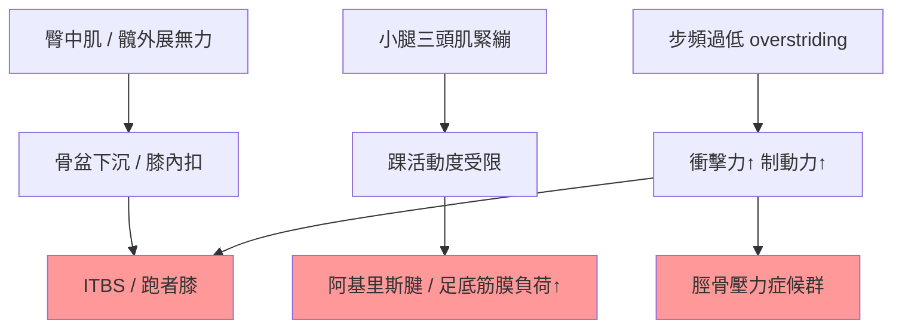
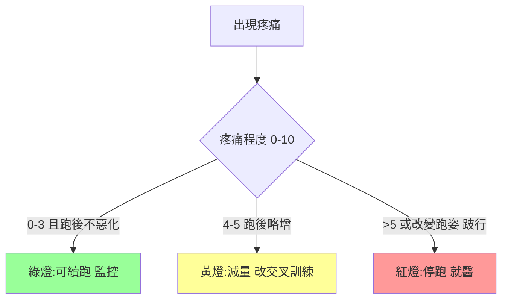

# 05 · 傷害預防與復健

> [⬅ 上一章:04 破4訓練計畫](04-破4訓練計畫.md) ｜ [回首頁](../README.md) ｜ [下一章:06 營養與補給 ➡](06-營養與補給.md)

破4最大的敵人往往不是體能,而是**受傷中斷訓練**。本章以運動醫學與物理治療視角,說明常見跑步傷害、生物力學成因,以及預防與復健策略。

> ⚠️ 本章為衛教參考,持續或劇烈疼痛請就醫,由專業人員診斷。

---

## 1. 跑者常見傷害總覽

| 傷害 | 部位 | 典型症狀 | 主要成因 |
|------|------|----------|----------|
| 髕股疼痛症候群(跑者膝 PFPS) | 膝前/髕骨周圍 | 上下樓、久坐後痛 | 臀肌無力、跑量驟增 |
| 髂脛束症候群(ITBS) | 膝外側 | 跑一段距離後外側刺痛 | 髖外展肌弱、跑姿 |
| 脛骨內側壓力症候群(Shin Splints) | 小腿內側 | 沿脛骨痠痛 | 跑量驟增、硬地、舊鞋 |
| 阿基里斯腱病變 | 跟腱 | 晨起僵硬、踮腳痛 | 小腿緊、突然增量 |
| 足底筋膜炎 | 腳跟/足底 | 起床第一步劇痛 | 足弓/小腿緊、跑量 |
| 壓力性骨折 | 脛骨/蹠骨 | 局部點狀痛、休息仍痛 | 過度訓練、能量不足(RED-S) |

> 🩺 多數為**過度使用傷害(overuse)**,核心成因高度重疊:**跑量/強度增加太快 + 肌力不足 + 恢復不夠**。

---

## 2. 生物力學:傷害的上游

關鍵上游問題:**髖部穩定肌群無力、踝關節活動度不足、步頻過低**。改善這三項能預防多數下肢傷害。

---

## 3. 預防:跑者必做肌力訓練

每週 2–3 次,不需重量也能起步:

| 動作 | 目標肌群 | 預防 |
|------|----------|------|
| 單腳硬舉(Single-leg RDL) | 臀肌、後鏈、平衡 | 跑者膝、ITBS |
| 側臥蚌式 / 側走彈力帶 | 臀中肌 | ITBS、膝內扣 |
| 提踵(雙腳→單腳) | 小腿三頭肌、跟腱 | 阿基里斯、脛痛 |
| 後腳抬高分腿蹲 | 股四頭、臀 | 整體下肢肌力 |
| 棒式 / 側棒 | 核心 | 跑姿穩定 |
| Nordic 腿後彎 | 腿後肌 | 拉傷預防 |

> 🏋️ **教練 + 物理治療共識**:肌力訓練不只防傷,還能改善**跑步經濟性**([02 原理](02-訓練原理.md)),是破4的隱藏武器。

---

## 4. 恢復(Recovery)四大支柱

| 支柱 | 重點 |
|------|------|
| **睡眠** | 每晚 7–9 小時,組織修復與荷爾蒙調節最關鍵 |
| **營養** | 蛋白質修復 + 醣類補充,詳見 [06 營養與補給](06-營養與補給.md) |
| **主動恢復** | 輕鬆跑/散步/游泳促進循環,優於完全靜止 |
| **負荷管理** | 遵守漸進原則與 ACWR(見 [03 訓練指標](03-訓練指標.md)) |

> 🧊 冰敷、按摩槍、滾筒、伸展可緩解不適,但證據顯示其「加速表現恢復」效果有限 —— **睡眠與營養才是主角**。

---

## 5. 受傷了怎麼辦?疼痛紅綠燈

- 急性處理現多採 **POLICE / PEACE & LOVE** 原則(取代舊的 RICE):適度負重(Optimal Loading)有助修復,而非一味完全休息。
- 壓力性骨折、無法承重、夜間痛屬紅燈,務必就醫。

---

## 6. 回歸跑步(Return to Run)原則

- 疼痛降到綠燈、能無痛快走 30 分鐘後,才開始「跑走交替」。
- 跑量從受傷前的 **50% 起步**,每週漸增,不可一次補回。
- 找回 [01 新手入門](01-新手入門.md) 的步頻與跑姿基本功。

---

## 📌 本章資料來源

- Dubois B, Esculier JF. "Soft-tissue injuries simply need PEACE and LOVE." *Br J Sports Med.* 2020.
- Lauersen JB, et al. "Strength training as superior injury prevention." *Br J Sports Med.* 2018.
- Mountjoy M, et al. "IOC consensus statement on RED-S." *Br J Sports Med.* 2018.

---

> [⬅ 上一章:04 破4訓練計畫](04-破4訓練計畫.md) ｜ [回首頁](../README.md) ｜ [下一章:06 營養與補給 ➡](06-營養與補給.md)
