# 06 · 營養與補給策略

> [⬅ 上一章:05 傷害預防與復健](05-傷害預防與復健.md) ｜ [回首頁](../README.md) ｜ [下一章:07 裝備指南 ➡](07-裝備指南.md)

馬拉松後半段的「撞牆」很大程度是**能量問題**。本章從運動營養學角度,涵蓋平日飲食、賽前肝醣超補、賽中補給與賽後恢復。

---

## 1. 平日飲食架構(訓練期)

| 營養素 | 建議攝取 | 角色 |
|--------|----------|------|
| **碳水化合物** | 5–8 g/kg 體重/天(高量訓練日更高) | 主要燃料、補肝醣 |
| **蛋白質** | 1.4–2.0 g/kg 體重/天 | 修復肌肉、適應 |
| **脂肪** | 約 20–35% 總熱量 | 荷爾蒙、長時間燃料 |
| **水分** | 依體重與流汗量,觀察尿液顏色 | 體溫調節、運送 |

> 🩺 **能量可用性(Energy Availability)**:長期攝取不足會導致 RED-S(運動相對能量不足),引發壓力性骨折、荷爾蒙失調([05 傷害預防](05-傷害預防與復健.md))。破4訓練量大,務必吃夠。

---

## 2. 賽前:肝醣超補(Carbo-Loading)

目標:把肌肉與肝臟的肝醣存量最大化,延後撞牆。

```mermaid
gantt
    title 賽前 3 天肝醣超補(現代簡化版)
    dateFormat X
    axisFormat D-%s
    section 跑量
    Taper 低跑量      :0, 3
    section 飲食
    高碳水 8-10 g/kg/天 :0, 3
```

- 現代做法不需「先耗竭再超補」的痛苦舊法。**賽前 1–3 天**搭配 Taper 降量,把碳水拉到 **8–12 g/kg/天**即可。
- 選擇好消化的碳水(白飯、麵、馬鈴薯、吐司),**減少高纖、高脂、高油**避免腸胃不適。
- 體重可能上升 1–2 kg(肝醣會結合水分),屬正常。

### 賽前一餐(賽前 3–4 小時)

- 1–4 g/kg 易消化碳水(如白吐司+蜂蜜、白飯、香蕉)。
- 低纖、低脂、低蛋白,避免腸胃負擔。
- 確認已測試過、腸胃能接受的食物(**Nothing new on race day!**)。

---

## 3. 賽中補給(In-Race Fueling)

馬拉松超過 90 分鐘,**必須補碳水**。

| 項目 | 建議 |
|------|------|
| 碳水攝取速率 | **30–60 g/小時**(破4約 4 小時,需持續補) |
| 補給形式 | 能量膠(gel)、運動飲料、香蕉、軟糖 |
| 時機 | 從**第 30–45 分鐘**開始,別等餓了才補 |
| 水分 | 依渴感與天氣,每個水站小口補 |
| 電解質 | 高溫/大量流汗時補鈉,預防低血鈉/抽筋 |

> 🍌 破4實戰範例:約每 40–45 分鐘一包能量膠(配水),搭配沿途水站。**所有補給都要在長跑訓練中演練過**。

---

## 4. 賽後恢復營養

把握賽後黃金時段:

| 時間 | 補給 | 目的 |
|------|------|------|
| 0–60 分鐘 | 碳水 + 蛋白(約 3:1) | 補肝醣、啟動修復 |
| 數小時內 | 正常正餐、補水補鈉 | 持續恢復 |
| 接下來數天 | 充足蛋白與熱量 | 組織修復、免疫 |

- 經典比例:**碳水 1.0–1.2 g/kg + 蛋白 0.3 g/kg**。
- 巧克力牛奶是常被引用的便利恢復飲(碳水+蛋白+水分)。

---

## 5. 補充品(Supplements)注意

- **咖啡因**:賽前 3–6 mg/kg 有實證提升耐力表現,但需先測試耐受度。
- 多數補品效果有限,**真食物優先**。
- 任何補品注意是否含違禁成分(若參加正式賽事)。

---

## 📌 本章資料來源

- Thomas DT, et al. "ACSM Joint Position Stand: Nutrition and Athletic Performance." *Med Sci Sports Exerc.* 2016.
- Burke LM, et al. "Carbohydrates for training and competition." *J Sports Sci.* 2011.
- Jeukendrup A. "A step towards personalized sports nutrition: carbohydrate intake during exercise." *Sports Med.* 2014.

---

> [⬅ 上一章:05 傷害預防與復健](05-傷害預防與復健.md) ｜ [回首頁](../README.md) ｜ [下一章:07 裝備指南 ➡](07-裝備指南.md)
