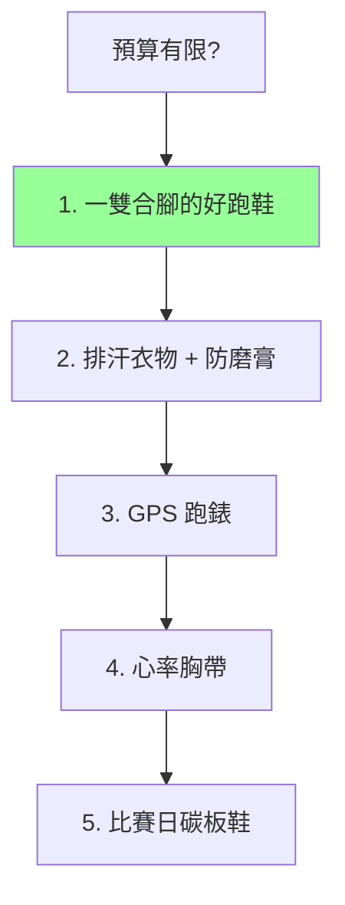

# 07 · 裝備指南

> [⬅ 上一章:06 營養與補給](06-營養與補給.md) ｜ [回首頁](../README.md) ｜ [下一章:08 國際賽事 ➡](08-國際賽事.md)

工欲善其事,必先利其器。本章從教練角度,聚焦對破4跑者真正有影響的裝備:跑鞋(含碳板競速鞋)、運動手錶與機能服飾。

---

## 1. 跑鞋:最關鍵的裝備

### 三種角色配置

| 類型 | 用途 | 特性 |
|------|------|------|
| **訓練鞋(日常)** | 大部分 E 輕鬆跑、長跑 | 緩衝足、耐操、舒適 |
| **節奏/輕量訓練鞋** | T 閾值、M 配速課 | 較輕、有回饋 |
| **碳板競速鞋(比賽日)** | 比賽、重點課 | 碳板 + 高回彈中底,極輕 |

> 🏃 **建議至少 2 雙輪替**:不同鞋款交替能分散負荷部位,降低過度使用傷害([05 傷害預防](05-傷害預防與復健.md)),也延長鞋壽命。

### 碳板鞋(Super Shoes)值得買嗎?

- 自 2017 年起,**碳纖維板 + 高能量回彈中底(如 PEBA 發泡)** 的「超級跑鞋」顯著改善跑步經濟性(研究顯示約 **4% 級別**的效率提升)。
- 對破4跑者,合適的碳板鞋可能換算成數分鐘成績,並減輕後段腿部疲勞。
- 注意:碳板鞋壽命較短、價格高,且需要一定肌力與適應,建議**比賽與重點課再穿**。

### 選鞋原則

- **合腳優先於品牌**:腳長 + 楦頭寬度,前掌留約一指空間(跑步腳會脹)。
- 落差(Drop)、緩衝依個人習慣與傷史調整,**沒有絕對最佳**。
- 一般跑鞋壽命約 **500–800 km**,中底塌陷即該換。

---

## 2. 運動手錶 / 穿戴裝置

GPS 跑錶是破4訓練的「儀表板」,把 [03 訓練指標](03-訓練指標.md) 即時化。

| 功能 | 用途 |
|------|------|
| GPS 配速/距離 | 即時監控是否在 M 配速 |
| 光學/胸帶心率 | 控制強度區間(胸帶較準) |
| 配速提示 / 虛擬配速員 | 比賽日穩定配速 |
| 訓練負荷 / 恢復建議 | 監控疲勞、避免過訓 |
| 自動分段(Lap) | 間歇與閾值課計時 |

> ⌚ **教練建議**:破4最實用的是「**即時配速 + 心率區間警示**」。比賽日善用「目標配速」功能避免前段衝太快(常見破4失敗主因)。胸帶心率帶準確度高於手腕光學,做心率訓練建議使用。

---

## 3. 機能服飾與配件

| 裝備 | 重點 |
|------|------|
| **排汗上衣** | 聚酯/機能纖維,**切勿穿純棉**(吸汗不排、磨擦) |
| **跑褲/緊身褲** | 防磨、支撐;長距離注意大腿內側摩擦 |
| **運動襪** | 排汗、防水泡;部分跑者用雙層襪防摩擦 |
| **防磨膏(Anti-chafing)** | 腋下、大腿內側、(男性)乳頭等易磨處 |
| **帽子/太陽眼鏡/袖套** | 防曬、防汗入眼 |
| **能量膠攜帶** | 腰帶、跑褲口袋、補給帶 |

> ⚠️ 黃金守則同 [06 營養](06-營養與補給.md):**Nothing new on race day** —— 比賽穿的所有裝備都要先在長跑訓練測試過,尤其防磨。

---

## 4. 裝備優先順序(預算有限時)

> 💡 對破4影響的優先序:**合腳跑鞋 > 配速監控 > 防磨舒適 > 碳板鞋**。碳板鞋是錦上添花,基本功與課表才是主體。

---

## 📌 本章資料來源

- Hoogkamer W, et al. "A comparison of the energetic cost of running in marathon racing shoes." *Sports Med.* 2018.
- Barnes KR, Kilding AE. "A randomized crossover study investigating the running economy of highly-cushioned shoes with carbon-fiber plates." *Sports Med.* 2019.
- World Athletics 競賽鞋具規範(賽鞋中底厚度限制等),見 [worldathletics.org](https://worldathletics.org/)。

---

> [⬅ 上一章:06 營養與補給](06-營養與補給.md) ｜ [回首頁](../README.md) ｜ [下一章:08 國際賽事 ➡](08-國際賽事.md)
