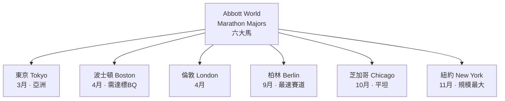
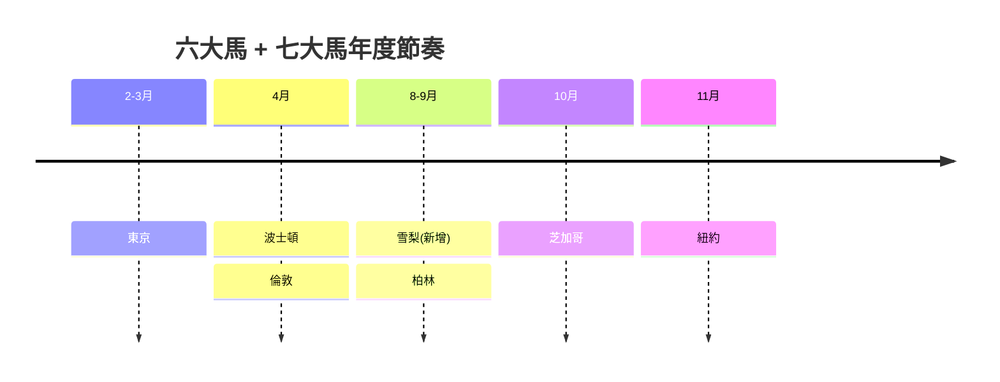

# 08 · 國際賽事

> [⬅ 上一章:07 裝備指南](07-裝備指南.md) ｜ [回首頁](../README.md) ｜ [下一章:09 關鍵人物與流派 ➡](09-關鍵人物與流派.md)

了解世界頂級賽事不只是文化薰陶,更是設定目標、規劃「人生清單」與體驗馬拉松巔峰氛圍的方式。本章介紹世界六大馬與其他指標賽事。

---

## 1. 世界馬拉松大滿貫(Abbott World Marathon Majors)

由六場世界最頂級的城市馬拉松組成,完成全部六場可獲得「**Six Star Finisher**」獎牌。

| 賽事 | 月份 | 特色 |
|------|------|------|
| **東京馬拉松** | 2–3 月 | 亞洲代表、組織嚴謹、賽道平坦 |
| **波士頓馬拉松** | 4 月 | 史上最悠久(1897~),**需達 BQ 資格門檻**,Heartbreak Hill 著名 |
| **倫敦馬拉松** | 4 月 | 慈善文化濃厚、觀眾熱情 |
| **柏林馬拉松** | 9 月 | **世界紀錄搖籃**,賽道最平最快 |
| **芝加哥馬拉松** | 10 月 | 平坦快速、城市風景 |
| **紐約市馬拉松** | 11 月 | **參賽人數最多**、五大區、橋多有起伏 |

> 🏅 2025 年起,**雪梨馬拉松(Sydney)** 加入成為第七場大滿貫賽事。

---

## 2. 為什麼柏林是「破紀錄聖地」?

- 賽道極平坦、彎道少、氣溫適中(9 月)。
- 多項馬拉松世界紀錄在此誕生,包括 Eliud Kipchoge 的 2:01:09(2022)。
- 對追求 PB 的市民跑者同樣友善 —— 想破4,平坦快速的賽道(柏林、芝加哥、東京)是好選擇。

> 賽道對成績影響很大:挑「平坦、海拔低、氣候涼爽」的賽事,比在多坡賽道更容易破4。

---

## 3. 報名與參賽門檻

| 方式 | 說明 |
|------|------|
| **抽籤(Ballot)** | 六大馬多採抽籤,中籤率低 |
| **達標(Qualifying)** | 波士頓需符合年齡組成績門檻(BQ);部分賽事有「快速跑者」直接錄取 |
| **慈善名額(Charity)** | 募款達標換取保證名額 |
| **旅遊套裝(Tour)** | 透過官方合作旅行社取得名額 |
| **大滿貫巡迴** | 完成資格賽可走 Wanda Age Group 等管道 |

> 💡 對破4跑者:**先在國內賽事達成 sub-4**,再規劃六大馬的「朝聖之旅」。國際賽事提早一年規劃報名與旅遊。

---

## 4. 其他值得認識的指標賽事

| 賽事 | 地區 | 特色 |
|------|------|------|
| 大阪 / 福岡 / 別府大分 | 日本 | 日本菁英傳統賽事 |
| 鹿特丹 / 阿姆斯特丹 | 荷蘭 | 平坦快速、歐洲熱門 PB 賽道 |
| 瓦倫西亞馬拉松 | 西班牙 | 近年崛起的超快賽道 |
| 兩岸三地大型馬 | 台北、香港、上海等 | 亞洲區在地大型賽事 |
| 奧運 / 世界田徑錦標賽馬拉松 | 國際 | 最高競技殿堂(見 [09 關鍵人物](09-關鍵人物與流派.md)) |

---

## 5. 國際賽事時間軸(典型年度)

---

## 📌 本章資料來源

- [Abbott World Marathon Majors 官方網站](https://www.worldmarathonmajors.com/)
- [Berlin Marathon](https://www.bmw-berlin-marathon.com/) ｜ [Boston Athletic Association](https://www.baa.org/)
- [World Athletics — Marathon](https://worldathletics.org/disciplines/road-running/marathon)

---

> [⬅ 上一章:07 裝備指南](07-裝備指南.md) ｜ [回首頁](../README.md) ｜ [下一章:09 關鍵人物與流派 ➡](09-關鍵人物與流派.md)
