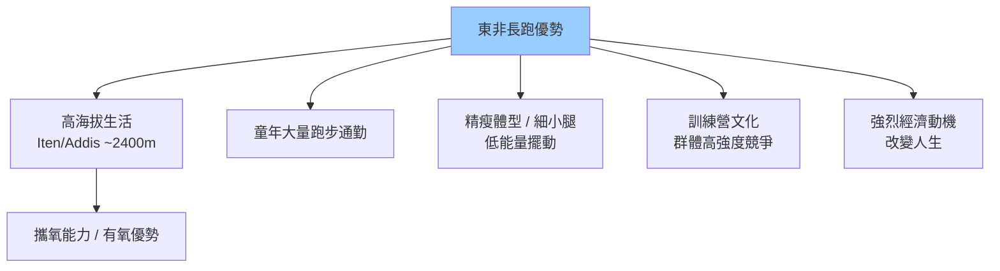
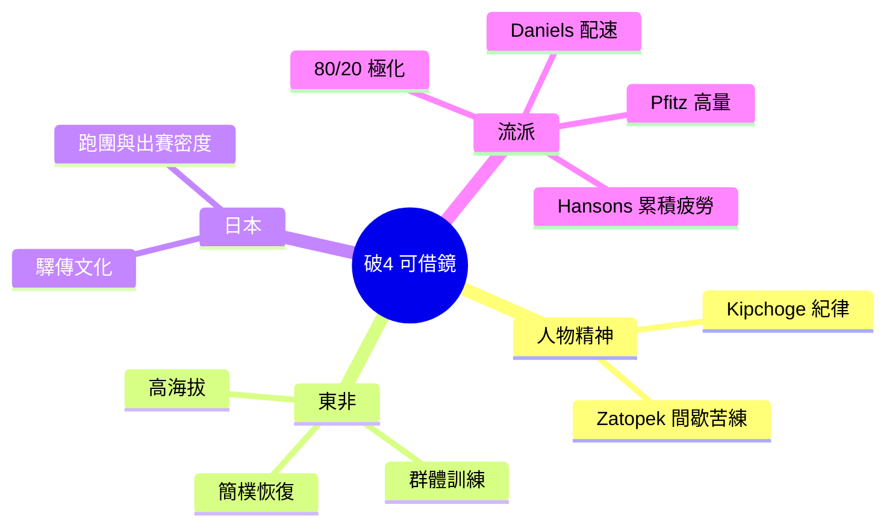

# 09 · 關鍵人物與訓練流派

> [⬅ 上一章:08 國際賽事](08-國際賽事.md) ｜ [回首頁](../README.md)

認識傳奇跑者與各國訓練流派,能幫你理解「不同訓練哲學如何造就頂尖表現」,並從中汲取適合自己的養分。本章涵蓋關鍵人物、東非長跑王朝與日本馬拉松文化。

---

## 1. 傳奇人物

### Eliud Kipchoge(肯亞)— 史上最偉大馬拉松跑者

- 多屆奧運馬拉松金牌,前馬拉松世界紀錄保持者(2:01:09,柏林 2022)。
- **2019 年 INEOS 1:59 Challenge**:在維也納以 **1:59:40** 成為史上首位(非正式條件下)跑進 2 小時的人類 —— 證明「**No Human Is Limited**」。
- 訓練哲學:紀律、簡樸、團隊訓練、極度重視恢復與自律。

> 💬 Kipchoge 名言「**Only the disciplined ones are free in life**」對破4跑者同樣受用:破4靠的是 16 週的紀律累積,而非某一天的爆發。

### 其他關鍵人物

| 人物 | 國籍 | 貢獻 |
|------|------|------|
| **Kelvin Kiptum** | 肯亞 | 2:00:35 馬拉松世界紀錄(芝加哥 2023),英年早逝令人惋惜 |
| **Brigid Kosgei / Ruth Chepng'etich** | 肯亞 | 女子馬拉松世界紀錄推進者 |
| **Paula Radcliffe** | 英國 | 長年女子世界紀錄(2:15:25, 2003)保持者 |
| **Haile Gebrselassie** | 衣索比亞 | 長跑傳奇、多項世界紀錄、賽道破2:04先驅 |
| **Abebe Bikila** | 衣索比亞 | 1960 羅馬奧運**赤腳**奪金,東非長跑崛起象徵 |
| **Emil Zátopek** | 捷克 | 1952 奧運 5000/10000/馬拉松三金,間歇訓練先驅 |

---

## 2. 東非長跑王朝(肯亞 / 衣索比亞)

為何肯亞、衣索比亞長期壟斷長跑頂峰?多因素交織:

- **高海拔訓練(Altitude Training)**:長期居住高海拔提升攜氧能力;「**Live High, Train Low**」是常見策略。
- **Iten(肯亞)** 被稱為「冠軍之家(Home of Champions)」,聚集大量世界級跑者的訓練營。
- 啟示:雖然我們難複製基因與海拔,但「**群體訓練、生活簡樸、重視恢復**」的精神可以學。

---

## 3. 日本馬拉松文化

日本是馬拉松「**群眾基礎最深厚**」的國家之一,自成一格的體系值得破4跑者認識。

| 元素 | 說明 |
|------|------|
| **箱根驛傳(Hakone Ekiden)** | 大學接力賽,新年舉辦,全國轉播,孕育無數菁英 |
| **企業實業團(Jitsugyodan)** | 企業贊助長跑隊,選手以員工身分專職訓練 |
| **驛傳(Ekiden)文化** | 接力賽培養龐大長跑人口與團隊精神 |
| **高出賽密度** | 日本市民跑者層峰厚實,sub-3 人口居世界前列 |

- 代表人物:**設樂悠太、大迫傑**(曾持日本馬拉松紀錄,推廣科學化訓練)。
- 啟示:日本證明「**深厚的群眾參與 + 系統化梯隊**」能整體拉高水準 —— 找到跑團、固定出賽,對破4也大有幫助。

---

## 4. 訓練流派對照(給破4跑者的選擇)

不同流派造就不同課表哲學,本知識庫 [04 破4訓練計畫](04-破4訓練計畫.md) 即綜合採用。

| 流派 | 代表 | 核心理念 | 適合 |
|------|------|----------|------|
| **VDOT / Daniels** | Jack Daniels | 以跑力對應精準配速區間 | 想要科學化配速者 |
| **Pfitzinger(Pfitz)** | Pete Pfitzinger | 高週量 + 大量馬拉松配速長跑 | 有時間、想衝成績 |
| **Hansons Method** | Hansons 兄弟 | 「累積疲勞」+ 長跑上限 16 miles | 時間有限、怕長跑受傷 |
| **MAF(低心率)** | Phil Maffetone | 嚴格低心率打有氧基礎 | 想穩紮有氧、防傷 |
| **極化 80/20** | Stephen Seiler | 八成輕鬆兩成高強度 | 多數業餘跑者通用 |

> 🎯 **結語**:破4不是天賦的專利,而是「**正確的原理 + 量化的指標 + 紀律的課表 + 完善的傷害與營養管理**」的總和。把本知識庫九個章節串起來,你已擁有一張完整的破4地圖。祝你順利達標!

---

## 📌 本章資料來源

- INEOS 1:59 Challenge 官方資料;World Athletics 選手檔案。
- Wilber RL, Pitsiladis YP. "Kenyan and Ethiopian distance runners: what makes them so good?" *Int J Sports Physiol Perform.* 2012.
- Tucker R, et al. "The genetic basis for elite running performance." *Br J Sports Med.* 2013.
- 各訓練流派原著:Daniels、Pfitzinger、Hansons、Maffetone、Seiler 等(見各章引用)。

---

> [⬅ 上一章:08 國際賽事](08-國際賽事.md) ｜ [回首頁](../README.md)
